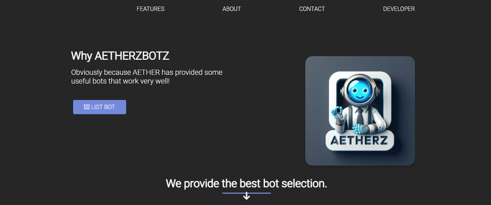
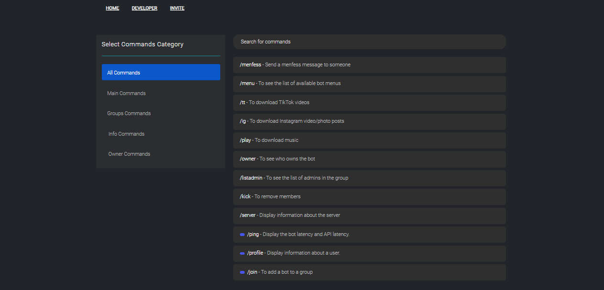

# LANDING-AETHERZBOTZ

AETHERZBOTZ is a powerful bot offering a variety of features for moderation, music, and more. This project provides a stunning website with a good UI design for Discord and WhatsApp bots, built with Bootstrap and ready to be customized.

## Features

- Easy to customize
- Custom cursor
- New fonts & favicon image
- Responsive command page
- Multiple bot functionalities including moderation and music

## Preview

### Main Page


### Commands Page


## Installation

1. Clone the repository:
   ```bash
   git clone https://github.com/aetherzcode/LANDING-AETHERZBOTZ.git
   ```

2. Navigate to the project directory:
   ```bash
   cd LANDING-AETHERZBOTZ
   ```

3. Open `index.html` in your web browser to view the project.

## Customization

You have full control over the source code. You can customize the design, colors, and text styles to fit your brand or bot features.

### Key Areas for Customization

1. **Background**: Change the color, texture, or image for the background of your site.
2. **Colors**: Choose a color palette that works well with your template.
3. **Text Style**: Modify sizes, colors, and styles of text for different sections.

## Contributing

Contributions are welcome! If you have suggestions for improvements or new features, feel free to create an issue or submit a pull request.

## License

This project is licensed under the MIT License - see the [LICENSE](LICENSE) file for details.

## Contact

For any inquiries, please contact the creator:

- **Creator**: AETHER
- **GitHub**: [aetherzcode](https://github.com/aetherzcode)
- **Website**: [AETHERz.xyz](https://aetherz.xyz)
